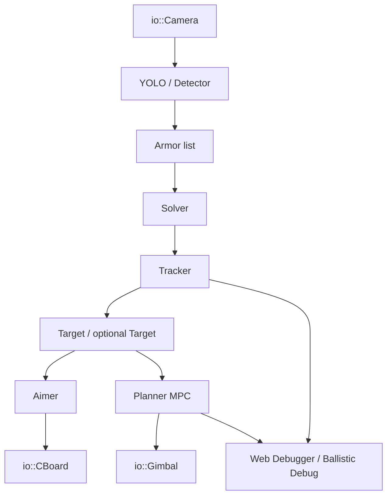
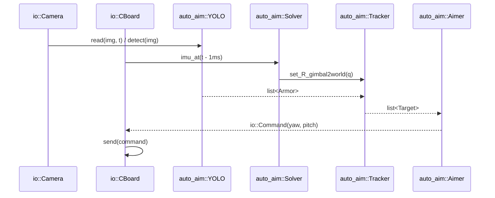
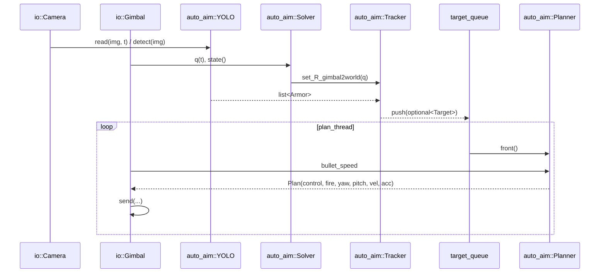
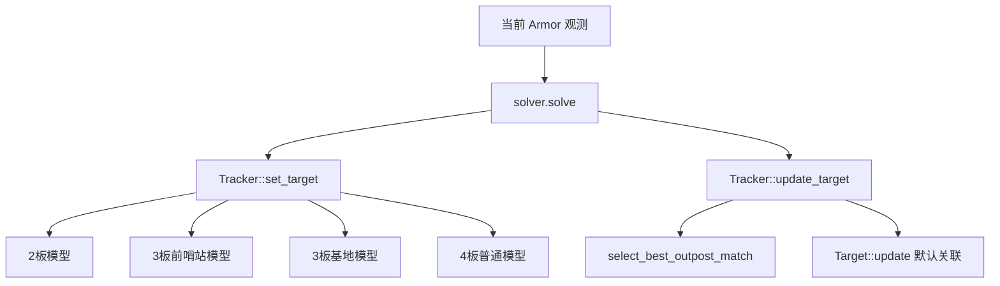
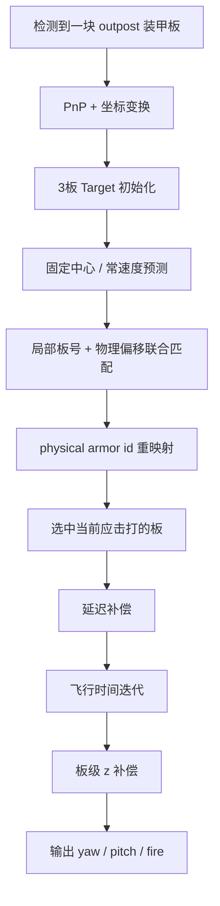

# sp_vision25 前哨站与常规装甲板方案详解

本文仿照 [docs/outpost_analysis.md](./outpost_analysis.md) 的结构来写，但内容完全以当前 `sp_vision25` 工程本身为准，目标是把这个项目里：

1. 前哨站方案是怎么工作的
2. 普通装甲板方案是怎么工作的
3. 两者共用了哪些链路、又在哪些地方分叉

讲清楚，方便后续学习代码、调参和现场定位问题。

## 1. 结论先行

这个项目里的前哨站并不是“单独再写了一套自瞄系统”，而是在通用自瞄链路上做了三层特化：

1. 识别层：
   前哨站首先只是一个 `ArmorName::outpost` 的类别，检测结果仍然是 4 个角点的装甲板观测。
2. 跟踪层：
   这里是前哨站最核心的特化。项目把前哨站建模为 `3` 块装甲板、同一半径、不同高度的旋转目标，并为它写了专用的匹配和状态预测逻辑。
3. 火控层：
   项目同时保留了两套火控思路：
   传统 `Aimer` 选板/弹道解算，以及 `Planner(MPC)` 的连续控制方案。
   其中完整的 `Aimer + Shooter` 串联主要出现在 `mt_standard.cpp`、`uav.cpp`、`sentry*.cpp` 这类入口；
   `standard.cpp` 当前只走到 `Aimer -> CBoard.send(command)`。
   前哨站在这两套方案里都复用了通用接口，但 `Planner` 分支现在已经有更完整的前哨站专用窗口、延迟、击打高度补偿和开火相位门。

一句话概括：

```text
前哨站 = 通用识别/解算 + 前哨站特化跟踪 + 通用火控框架中的前哨站专用策略
普通装甲板 = 通用识别/解算 + 四板/两板目标跟踪 + 通用火控
```

## 2. 本项目的主入口与运行模式

如果从“这个工程到底怎么跑起来”看，自动瞄准主要有三条入口：

### 2.1 `src/standard.cpp`

这是普通自瞄链路，使用：

- `io::CBoard`
- `auto_aim::YOLO`
- `auto_aim::Solver`
- `auto_aim::Tracker`
- `auto_aim::Aimer`

链路形式是：

```text
相机图像
  -> YOLO 检测
  -> Solver 解算
  -> Tracker 跟踪
  -> Aimer 计算 yaw/pitch
  -> CBoard 下发
```

要特别注意：

1. `standard.cpp` 虽然实例化了 `Shooter`，但当前没有真正调用 `shooter.shoot()`；
2. 因此它更适合学习“传统自瞄的最小主链”，而不是完整的传统开火门控链路；
3. 如果你要看完整的 `Aimer + Shooter` 串联，应该进一步看 `mt_standard.cpp`、`uav.cpp` 或 `sentry*.cpp`。

### 2.2 `src/standard_mpc.cpp`

这是 MPC 控制链路，使用：

- `io::Gimbal`
- `auto_aim::YOLO`
- `auto_aim::Solver`
- `auto_aim::Tracker`
- `auto_aim::Planner`

其中主线程负责感知，`plan_thread` 负责以固定频率规划和下发控制量。

链路形式是：

```text
感知线程：相机 -> YOLO -> Solver -> Tracker -> Target队列
规划线程：Target队列 -> Planner(MPC) -> Gimbal.send(...)
```

这个入口更适合学习“连续控制、自瞄预测、MPC 参考轨迹”。

### 2.3 `src/auto_aim_debug_mpc.cpp`

这是最适合学习前哨站方案的入口，因为它除了 `standard_mpc.cpp` 的主链路外，还增加了：

- Web 调试器
- 弹道诊断面板
- 选板 / 延迟 / 命中时刻 / tracker 匹配等内部量可视化

如果你主要想理解“前哨站实战调参是怎么落到代码上的”，建议优先看这个入口。

还要补充一条当前实现差异：

1. `standard_mpc.cpp` 使用独立 `plan_thread`；
2. `auto_aim_debug_mpc.cpp` 当前是在主循环里直接完成 `detect -> track -> plan -> send`，再叠加调试输出；
3. 所以它们算法主链一致，但线程组织方式并不完全相同。

### 2.4 三条主链路总览图



### 2.5 `standard.cpp` 时序图



说明：

1. 这张图对应的是当前 `standard.cpp` 的真实行为；
2. 如果你要看 `Aimer + Shooter` 都接上的完整传统链路，请改看 `mt_standard.cpp` 或 `uav/sentry`。

### 2.6 `standard_mpc.cpp` 时序图



补充说明：

1. `standard_mpc.cpp` 是“主线程感知 + plan_thread 规划”；
2. `auto_aim_debug_mpc.cpp` 当前则是“主循环直接 detect -> track -> plan -> send”，只是额外挂了更多调试与网页输出。

## 3. 共用数据结构与坐标链路

无论是前哨站还是普通装甲板，本项目共用下面几个核心数据对象。

### 3.1 `Armor`

定义在 `tasks/auto_aim/armor.hpp`。

它是检测层和跟踪层之间的统一中间表示，里面既有：

- 2D 信息：角点、中心、框、类别、颜色、置信度
- 3D 信息：`xyz_in_world`、`ypr_in_world`、`ypd_in_world`

当前项目中：

- `ArmorName::outpost` 表示前哨站装甲板
- `ArmorName::one/two/three/four/five/sentry/base` 表示常规装甲板类别

### 3.2 `Target`

定义在 `tasks/auto_aim/target.hpp/.cpp`。

它是 Tracker 输出给火控层的目标状态对象，内部是 11 维 EKF 状态。

状态向量为：

```text
x = [cx, vcx, cy, vcy, cz, vcz, yaw, vyaw, r, l, h]
```

含义如下：

- `cx, cy, cz`：目标旋转中心
- `vcx, vcy, vcz`：中心速度
- `yaw, vyaw`：参考装甲板相位与角速度
- `r`：基础旋转半径
- `l, h`：
  对普通四板目标表示长短半径差和高度差
  对前哨站则主要保留通用接口意义，真正的板间高度来自 `outpost_armor_z_offsets`

### 3.3 坐标链路

所有目标最终都走同一条坐标链：

```text
像素角点
  -> solvePnP(IPPE)
  -> 相机坐标系
  -> 云台坐标系
  -> 世界坐标系
```

这一层由 `tasks/auto_aim/solver.cpp` 负责。

## 4. 识别层：前哨站和普通装甲板共用什么

### 4.1 检测入口

项目通过 `tasks/auto_aim/yolo.cpp` 统一封装检测器，根据配置里的 `yolo_name` 选择：

- `YOLOV5`
- `YOLOV8`
- `YOLO11`

默认主配置 `configs/standard3.yaml` 使用的是：

```yaml
yolo_name: yolov5
device: GPU
use_traditional: true
```

这意味着当前主链路是：

```text
YOLOV5 神经网络检测
  + 可选传统方法二次角点矫正
```

### 4.2 YOLO 输出是什么

以 `tasks/auto_aim/yolos/yolov5.cpp` 为例，检测结果包含：

- 颜色类别
- 编号类别
- 4 个角点
- 置信度

随后在 `tasks/auto_aim/armor.cpp` 构造成 `Armor`。

所以对于前哨站来说，识别层输出的仍然只是：

```text
“这是一块 outpost 装甲板 + 这块板的四角点”
```

它不会在检测阶段直接给出：

- 转轴中心
- 三块板的整体编号
- 角速度

这些信息都要等到跟踪层去恢复。

### 4.3 传统检测器在项目中的作用

`tasks/auto_aim/detector.cpp` 仍然保留了完整的传统视觉检测流程：

1. 灰度化
2. 阈值分割
3. 轮廓提取
4. 灯条几何筛选
5. 灯条配对生成装甲板
6. 图案分类与类型检查

但在主用配置里，它更多承担的是：

- 作为独立传统方案
- 或者给 YOLOV5 做二次角点矫正

因此，当前项目里的前哨站识别并没有单独的一套“前哨站专用 detector”，它和普通装甲板共享识别入口。

## 5. 解算层：前哨站和普通装甲板如何从 2D 变成 3D

`tasks/auto_aim/solver.cpp` 负责位姿解算。

核心步骤如下：

1. 根据装甲板类型选择 3D 模板点：
   - 大装甲板：`BIG_ARMOR_POINTS`
   - 小装甲板：`SMALL_ARMOR_POINTS`
2. 用 `cv::solvePnP(..., cv::SOLVEPNP_IPPE)` 求位姿
3. 用 `R_camera2gimbal`、`t_camera2gimbal`、`R_gimbal2world` 做坐标变换
4. 得到：
   - `xyz_in_world`
   - `ypr_in_world`
   - `ypd_in_world`
5. 对非平衡目标再做一次 `yaw` 优化，降低重投影误差

这里前哨站和普通装甲板最关键的区别有一个：

### 5.1 重投影姿态中的 pitch 倾角假设不同

`Solver::reproject_armor()` 里写死了：

- 前哨站：`pitch = -15 deg`
- 普通装甲板：`pitch = +15 deg`

这说明项目默认认为：

1. 普通装甲板在几何重投影上是“向前倾”
2. 前哨站装甲板在几何重投影上是“向后倾”

这直接影响：

- 重投影误差
- tracker 匹配质量
- 选板时的空间位置估计

也就是说，前哨站从这里开始就已经不是“纯粹同一块小装甲板”了。

## 6. 跟踪层总览：前哨站和普通装甲板在哪分叉

`tasks/auto_aim/tracker.cpp` 是项目里最重要的分叉点。

### 6.1 统一状态机

无论是什么目标，外层都共用这套状态机：

- `lost`
- `detecting`
- `tracking`
- `temp_lost`
- `switching`（全向感知分支使用）

状态机只负责回答两个问题：

1. 现在是否存在一个可信目标
2. 当前目标应该继续更新，还是彻底丢弃

### 6.2 初始化时按目标类型选择模型

`Tracker::set_target()` 会根据当前装甲板类型初始化不同 `Target`：

1. 平衡步兵：
   使用 `2` 板模型
2. 前哨站：
   使用 `3` 板模型
3. 基地：
   使用 `3` 板模型
4. 其他普通目标：
   使用 `4` 板模型

因此这个工程里其实同时存在三种旋转体建模：

```text
2板：平衡步兵
3板：前哨站 / 基地
4板：普通装甲目标
```

### 6.3 跟踪分叉图



## 7. 普通装甲板方案详解

这里先把“普通目标”讲清楚，再看前哨站会更容易。

### 7.1 普通目标的几何模型

在 `Target::h_armor_xyz()` 里，普通四板模型采用的是：

- 偶数板：半径 `r`，高度 `cz`
- 奇数板：半径 `r + l`，高度 `cz + h`

也就是：

```text
普通目标 = 两组交替半径 + 两组交替高度
```

这适合描述 RoboMaster 常见的四面装甲目标：

- 前后两板一组
- 左右两板一组

### 7.2 普通目标的观测更新

普通目标的 `Tracker::update_target()` 流程比较直接：

1. 先对 `target_` 做预测
2. 找到所有同名同类型 `Armor`
3. 对每个候选装甲板做 `solver.solve()`
4. 由 `Target::update(armor)` 内部做关联

而 `Target::update()` 的默认策略是：

1. 先从 `armor_xyza_list()` 生成所有理论板位
2. 选距离较近的几个候选
3. 用：
   - 装甲板 yaw 差
   - 视线 yaw 差
   做一个简单代价函数
4. 选择最匹配的板号

这个方案对普通四板目标已经够用，因为普通目标的：

- 板数固定
- 高度关系简单
- 物理板和局部板号不会频繁重映射

### 7.3 普通目标的火控方案

普通目标在项目里有两套火控。

#### 方案 A：`Aimer` 与 `Shooter`

传统模块能力上，项目仍然保留 `Aimer + Shooter` 这条路线；
但在入口层要区分：

1. `standard.cpp`
   当前只走 `Aimer -> cboard.send(command)`；
2. `mt_standard.cpp`、`uav.cpp`、`sentry*.cpp`
   才真正把 `Shooter::shoot()` 串在 `Aimer` 后面。

`Aimer::aim()` 的核心逻辑是：

1. 按角速度阈值决定高低速延迟
2. 把目标预测到“当前决策时刻”
3. 调 `choose_aim_point()` 选中要打的装甲板
4. 做弹丸飞行时间迭代
5. 输出最终 `yaw / pitch`

普通目标选板时分两种：

1. 非小陀螺：
   只在可见角内选板，并尽量锁住同一块板
2. 小陀螺：
   用 `coming_angle/ leaving_angle` 决定哪块板正在进入射击窗口

如果入口接了 `Shooter`，它会在最后再增加一层门控：

1. 命令不能突变太大
2. 当前云台角要接近上一帧命令
3. `debug_aim_point` 必须有效

这样可以减少“命令刚跳变就误击发”。

但一定要记住：

```text
模块里存在 Shooter
不等于 standard.cpp 当前就在用 Shooter
```

#### 方案 B：`Planner(MPC)`

用于 `src/standard_mpc.cpp`、`src/auto_aim_debug_mpc.cpp`。

`Planner` 的逻辑更像连续控制器：

1. 先按延迟预测目标
2. 再做“命中时刻固定点迭代”
3. 用选中的板构造未来参考轨迹
4. 分别对 yaw / pitch 解 MPC
5. 输出：
   - 位置
   - 速度
   - 加速度
   - `fire`

相对 `Aimer`，`Planner` 的优势是：

1. 参考轨迹更平滑
2. 更适合直接对接云台控制器
3. 更容易做可视化和调参

## 8. 前哨站方案详解

前哨站方案的关键不在检测，而在“如何从一块正在看到的板恢复出三板旋转体”。

### 8.1 前哨站的目标模型

前哨站在 `Tracker::set_target()` 中被初始化为：

- 半径：`outpost_radius`
- 板数：`3`
- 高度偏置：`outpost_armor_z_offsets`
- 可选固定中心模型：`outpost_fixed_center_rotation_model`
- 收敛后角速度锁：`outpost_spin_speed_lock`

默认几何是：

```yaml
outpost_radius: 0.2765
outpost_armor_z_offsets: [0.0, -0.102, 0.102]
```

也就是三块板：

1. 一块基准高度
2. 一块低 `0.102 m`
3. 一块高 `0.102 m`

### 8.2 前哨站的状态预测

前哨站在 `Target::predict()` 中有两种工作模式。

#### 模式 A：固定中心旋转模型

当 `outpost_fixed_center_rotation_model=true` 时：

- `vx, vy, vz` 会被压回 `0`
- 中心默认不平移
- 只让 `yaw` 随 `vyaw` 变化
- 过程噪声比普通目标小很多

这等价于认为：

```text
前哨站主要是绕固定中心转，而不是在平面上做机动
```

对前哨站来说，这通常比普通车体模型稳定。

#### 模式 B：普通常速度模型

如果关闭固定中心模型，就退回普通常速度 EKF 预测。

不过对前哨站实战来说，一般不如固定中心模型好调。

### 8.3 前哨站的角速度锁

`Target::predict()` 里还有一个很关键的逻辑：

当目标已经收敛，且是前哨站，且 `|vyaw| > 2` 时，会把角速度锁到：

```text
+outpost_spin_speed_lock 或 -outpost_spin_speed_lock
```

作用是：

1. 防止 EKF 对前哨站角速度估计漂来漂去
2. 让旋转速度在稳定跟踪后更接近固定值
3. 提高后续选板与火控预测稳定性

### 8.4 前哨站为什么不能直接用普通匹配

普通目标的默认匹配更像“就近关联”，而前哨站多了两个额外难点：

1. 三块板存在高度差
2. 同一局部板号和真实物理板号之间可能发生偏移

所以项目为前哨站单独写了：

`select_best_outpost_match()`

它会同时枚举：

1. 当前局部板号 `id`
2. 物理板号偏移 `offset`

对每一种组合计算综合代价，代价包含：

- 重投影误差
- 视线 yaw 误差
- pitch 误差
- 距离误差
- 装甲板 yaw 误差
- xy 位置误差
- z 位置误差
- 和上一帧的连续性惩罚

最后再通过 `accept_outpost_match()` 做一轮门限筛选。

这一步是当前项目前哨站方案里最“专门化”的代码之一。

### 8.5 物理板号重映射

前哨站还引入了一个普通目标没有的概念：

```text
local armor id
vs
physical armor id
```

对应接口在 `Target` 里：

- `physical_armor_id()`
- `set_armor_id_offset()`
- `armor_z_offset()`

它的作用是：

1. 局部板号负责当前几何顺序
2. 物理板号负责真实哪块板在高、哪块板在低
3. 当匹配发现板号需要整体平移时，只改偏移 `offset`
4. 同时用 `ekf_.x[4] += old_z - new_z` 保证高度连续

这一层处理掉了“看起来是第 1 块，实际上对应物理低板”的问题。

### 8.6 前哨站的火控方案

前哨站在火控层同样分两套。

#### 方案 A：`Aimer`

在 `tasks/auto_aim/aimer.cpp` 里，前哨站会被强制视为小陀螺目标：

- `use_spin_gate = true`
- 进入窗口角固定为 `70 deg`
- 离开窗口角固定为 `30 deg`

注意这里有一个很重要的项目现状：

```text
Aimer 分支的前哨站窗口目前仍然是代码内固定值
```

也就是说，`standard.cpp` 这条普通火控链路里，前哨站仍然沿用硬编码 `70/30`。

#### 方案 B：`Planner(MPC)`

在 `tasks/auto_aim/planner/planner.cpp` 里，前哨站支持更完整的专用参数：

- `outpost_coming_angle`
- `outpost_leaving_angle`
- `outpost_delay_time`
- `outpost_fire_z_compensation`

当前 `Planner` 对前哨站做了这些专用处理：

1. 前哨站选板角窗口可单独配置
2. 前哨站可使用固定专用延迟，而不是走通用高低速延迟切换
3. 前哨站三块板可以附加单独的击打高度补偿
4. 对前哨开火还会额外检查：
   - 命中时刻固定点迭代是否收敛
   - 选中板是否进入更紧的相位窗口
   - 如果已经 `jumped`，是否真的是通过 `spin gate` 选中的板，而不是 fallback 板
5. 调试信息会额外暴露：
   - 选中局部板号
   - 选中物理板号
   - 原始板高度偏置
   - 额外击打高度补偿

这意味着当前项目里：

```text
前哨站最完整、最适合调试和实战优化的方案，是 Planner / auto_aim_debug_mpc 这一支
```

### 8.7 前哨站从观测到击打的完整图



## 9. 前哨站与普通装甲板的核心差异汇总

| 维度 | 普通装甲板 | 前哨站 |
|---|---|---|
| 检测 | 通用 YOLO / Detector | 同一套检测，只是类别不同 |
| 装甲板数量 | 常见 4 板，平衡 2 板 | 3 板 |
| 几何高度 | 用 `h` 建模两组高度 | 用 `outpost_armor_z_offsets` 建模三板高度 |
| 半径模型 | `r` 或 `r+l` 交替 | 同一 `r` |
| 角速度模型 | 常速度 + 大过程噪声 | 可选固定中心 + 小过程噪声 + 转速锁 |
| 匹配方式 | 默认近邻 + 角度误差 | 专用 `id + offset` 联合匹配 |
| 物理板重映射 | 无 | 有 |
| Aimer 窗口 | 配置 `coming/leaving` | 强制 `70/30` |
| Planner 窗口 | 通用参数 | 有前哨站专用参数与相位开火门 |
| 高度补偿 | 通常靠 `pitch_offset` | 可单独对某块物理板加 `z` 补偿 |

```
eg运算：
   outpost_spin_speed_lock ≈ 2.51 rad/s ≈ 144°/s
   outpost_delay_time ≈ 0.078 s
   再加上常见飞行时间大约 0.12 ~ 0.18 s
   总提前时间大约 0.20 ~ 0.26 s，对应相位大约 29° ~ 37°。再加 15° ~ 20° 保险量，coming_angle 落在 45° ~ 57° 很正常，所以你现在的 60° 是讲得通的。
```

## 10. 调试与学习时建议重点看的文件

如果你想真正把这个工程读通，建议按下面顺序看。

### 10.1 第一步：看入口

- `src/standard.cpp`
- `src/mt_standard.cpp`
- `src/standard_mpc.cpp`
- `src/auto_aim_debug_mpc.cpp`

目标：

先弄清楚不同入口到底调用的是：

- `Aimer`
- `Shooter`
- 还是 `Planner`

否则后面很容易出现“改了参数但根本没生效”的情况。

### 10.2 第二步：看统一数据流

- `tasks/auto_aim/armor.hpp/.cpp`
- `tasks/auto_aim/solver.cpp`

目标：

弄清楚从检测框到世界坐标 `xyz / ypr / ypd` 是怎么来的。

### 10.3 第三步：看跟踪

- `tasks/auto_aim/tracker.cpp`
- `tasks/auto_aim/target.cpp`

目标：

看明白：

1. 普通目标为什么是 4 板
2. 前哨站为什么是 3 板
3. 前哨站为什么需要 `offset` 重映射

### 10.4 第四步：看火控

- 普通方案：`tasks/auto_aim/aimer.cpp`、`tasks/auto_aim/shooter.cpp`
- MPC 方案：`tasks/auto_aim/planner/planner.cpp`

目标：

把“选板、延迟、飞行时间、开火门控”四件事分开理解。

### 10.5 第五步：最后看调试入口

- `src/auto_aim_debug_mpc.cpp`
- `tools/debug_visualization.cpp`
- `assets/web_debugger/static/js/main.js`

目标：

知道你在网页里看到的：

- selected armor
- physical armor
- selected z offset
- aim z compensation

分别对应哪一层逻辑。

## 11. 当前项目里值得注意的工程特征

### 11.1 前哨站火控最完整的是 MPC 分支

如果你是为了学习“当前项目怎样认真打前哨站”，优先看：

- `auto_aim_debug_mpc.cpp`
- `planner.cpp`

因为这里的前哨站参数已经细化到：

- 角窗口
- 固定延迟
- 板级高度补偿
- 命中时刻收敛判断
- 相位开火门

而 `Aimer` 分支目前还没做到这么细。

### 11.2 检测层并不区分“前哨站专用 detector”

所以如果前哨站表现不好，不要第一反应就去怪识别。

在这个工程里，更常见的瓶颈其实是：

1. 三板匹配不稳
2. 高低板映射不对
3. 延迟或击打高度补偿不合适

### 11.3 这个项目已经把“前哨站跟踪”和“前哨站火控”拆开了

这是一个很好的学习点。

你可以把它理解为：

```text
Tracker 负责描述目标“是什么、转得怎样”
Planner/Aimer 负责决定“现在该打哪块板、提前多少、压多少 pitch”
```

这样现场调参就不会混成一锅。

## 12. 总结

对当前 `sp_vision25` 来说：

1. 普通装甲板方案的重点是“四板/两板目标建模 + 通用选板 + 通用弹道补偿”。
2. 前哨站方案的重点是“三板模型 + 板号重映射 + 固定中心旋转 + 专用火控窗口/延迟/高度补偿”。
3. 如果只是想理解最简主链，`standard.cpp` 足够；如果想看传统完整火控，还要补看 `mt_standard.cpp`。
4. 如果想真正理解当前工程的前哨站打法，应该优先读 `tracker.cpp + target.cpp + planner.cpp + auto_aim_debug_mpc.cpp`。

可以把这份文档当作这几个文件的阅读导航：

```text
入口看 src
几何看 solver
状态看 tracker/target
普通火控看 aimer/shooter
前哨站精细火控看 planner + auto_aim_debug_mpc
```
