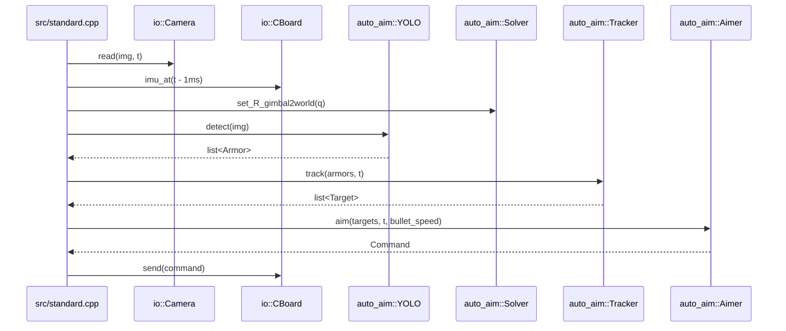
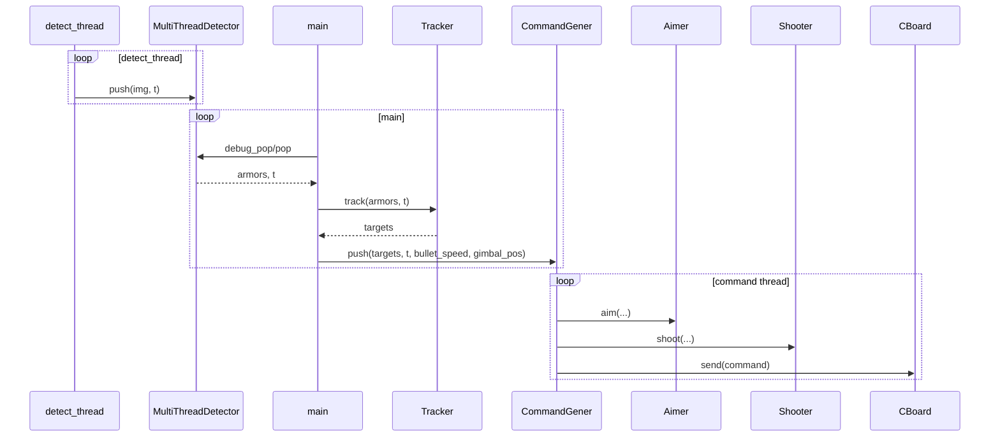
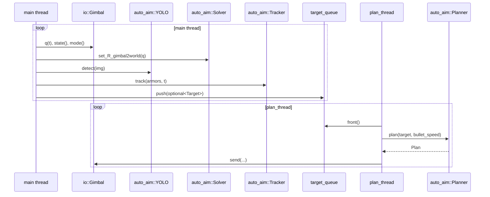

# 调用时序与 YAML 参数映射

这份文档不再只是“参数在哪里读”的速查表，而是面向教学和传承，回答四件事：

1. 当前工程几条主链路到底怎么调用。
2. 每组 YAML 参数在算法里真正控制的是什么量。
3. 参数为什么要这样设计，而不是只给一个经验值。
4. 参数调大、调小、调错后，实车上通常会看到什么现象。

建议把它当成“调参讲义”来用，而不只是“参数索引表”。

## 1. 先看入口：不同入口决定同一个参数是否真的生效

很多调参问题不是“参数没用”，而是“当前入口根本没走那段代码”。

所以在看任何 YAML 参数前，先确认三件事：

1. 当前跑的是哪个入口。
2. 当前控制器是 `Aimer` 还是 `Planner`。
3. 当前开火门是 `Shooter` 还是 `Planner.fire`。

## 2. 当前主用三条链路

### 2.1 `standard.cpp`

当前真实链路是：



关键事实：

1. 当前 `standard.cpp` 不真正调用 `Shooter::shoot()`。
2. 所以 `first_tolerance`、`second_tolerance`、`judge_distance`、`auto_fire` 在这条入口里不会决定最终开火。
3. 这条链更适合看“检测 -> 解算 -> 跟踪 -> 出瞄准角”。

### 2.2 `mt_standard.cpp`

当前真实链路是：



关键事实：

1. 这是当前传统链里最完整的一条。
2. `Aimer` 和 `Shooter` 都真的生效。
3. 传统链相关参数在这条入口里最容易观察到真实效果。

### 2.3 `standard_mpc.cpp` / `auto_aim_debug_mpc.cpp`

当前真实链路是：



关键事实：

1. `Planner` 直接输出连续控制量和 `fire`。
2. 这条链不走 `io::Command`。
3. 这条链不走 `Shooter`。
4. `fire_thresh`、`Q/R`、`max_yaw_acc/max_pitch_acc`、`outpost_*` 在这条链才是核心参数。

## 3. 读参数前要先有的算法分层观念

当前自动瞄准参数大致分成六层：

1. 检测层参数
   决定“能不能稳定看到板”
2. 解算层参数
   决定“角点如何变成 3D 观测”
3. 跟踪层参数
   决定“目标状态是否稳定连续”
4. 传统瞄准参数
   决定 `Aimer` 打哪块板、提前多少
5. 传统开火参数
   决定 `Shooter` 什么时候放火
6. MPC 规划参数
   决定 `Planner` 跟得多紧、动作多猛、什么时候放火

后面每组参数我都按下面四个问题解释：

1. 参数控制了什么算法量。
2. 为什么算法里需要这个量。
3. 调大调小分别会出现什么现象。
4. 推荐先调什么，再调什么。

## 4. 参数总览表

先给一张速查表，后面再逐组展开。

| YAML 键 | 读取位置 | 主要生效链路 | 主要影响 |
|---|---|---|---|
| `yolo_name` / `*_model_path` / `device` | `yolo.cpp`、各 `yolos/*.cpp` | 全部 YOLO 链 | 检测模型选择 |
| `min_confidence` / `use_roi` / `roi.*` / `use_traditional` | `yolos/*.cpp`、`detector.cpp` | 检测链 | 看见板的稳定性与速度 |
| `threshold`、几何过滤参数 | `detector.cpp` | 传统检测、YOLO 二次角点矫正 | 角点质量、误检漏检 |
| 外参内参参数 | `solver.cpp` | 全部自瞄链 | 空间解算正确性 |
| `enemy_color` / `min_detect_count` / `max_temp_lost_count` | `tracker.cpp` | 全部自瞄链 | 状态机收敛与丢失逻辑 |
| `outpost_radius` / `outpost_*` 跟踪参数 | `tracker.cpp` | 前哨 | 3 板几何与旋转预测 |
| `yaw_offset` / `pitch_offset` / `coming_angle` / `leaving_angle` / `decision_speed` / `*delay*` | `aimer.cpp` | 传统链 | 选板与提前量 |
| `first_tolerance` / `second_tolerance` / `judge_distance` / `auto_fire` | `shooter.cpp` | 真正走 `Shooter` 的入口 | 传统开火判定 |
| `fire_thresh` / `max_*_acc` / `Q_*` / `R_*` | `planner.cpp` | MPC 链 | 跟踪紧度、平滑度、开火条件 |
| `outpost_coming_angle` / `outpost_leaving_angle` / `outpost_delay_time` / `outpost_fire_z_compensation` | `planner.cpp` | 前哨 MPC | 前哨选板、提前量、相位门、击打高度 |

## 5. 检测层参数

### 5.1 模型选择参数

#### `yolo_name`

- 读取位置：`tasks/auto_aim/yolo.cpp`
- 算法意义：选择具体检测器实现
- 为什么需要：当前工程把 `YOLOV5/YOLOV8/YOLO11` 统一封装，但不同模型的输出格式、精度、延迟都不同

调节理解：

1. 它不是“阈值参数”，而是“切整套检测器”。
2. 切模型后，后面的 `min_confidence`、ROI、角点矫正效果都会跟着变。

教学上要强调：

```text
切模型 = 改变观测源
不是只改一个检测灵敏度开关
```

#### `*_model_path`

- 算法意义：指定模型文件
- 实际影响：不改变算法逻辑，但决定你运行的是哪一版权重

教学重点：

1. 这是“实验版本切换”参数。
2. 如果前后模型训练集不同，后面所有阈值都可能要重调。

#### `device`

- 算法意义：指定 OpenVINO 运行设备
- 实际影响：主要影响推理延迟和吞吐，不直接影响检测结果

调节理解：

1. 延迟变了，会间接影响后面的跟踪与延迟补偿。
2. 所以换设备后，`delay_time` 类参数常常也要复核。

### 5.2 检测阈值与 ROI

#### `min_confidence`

- 读取位置：各 `yolos/*.cpp`，传统 `detector.cpp`
- 算法意义：分类/检测结果的最低接受置信度
- 为什么需要：观测噪声太大时，后端 EKF 不是万能的，先把明显不可信观测挡掉更有效

调大：

1. 误检减少
2. 漏检增多
3. 远距离、小目标、遮挡场景更容易掉目标

调小：

1. 更容易看到远目标
2. 误检增多
3. 跟踪层会更容易被假目标或错分类扰动

实车现象：

1. “远处偶尔能看见，但一会儿就丢”可能是太高。
2. “画面边角老出现奇怪目标，跟踪乱跳”可能是太低。

推荐调法：

1. 先保证几乎没有明显误检
2. 再一点点降低，直到远距离稳定性达到能接受的上限

#### `use_roi`

- 算法意义：是否只在 ROI 区域内做检测
- 为什么需要：通过减少搜索范围换取更高帧率和更低误检

调成 `true`：

1. 速度更快
2. ROI 外目标直接看不到
3. 对大幅机动场景更敏感

调成 `false`：

1. 全图更稳妥
2. 速度下降
3. 误检候选增多

教学重点：

```text
ROI 本质上是在“先验搜索范围”和“全局发现能力”之间做交换
```

#### `roi.x / roi.y / roi.width / roi.height`

- 算法意义：定义检测窗口
- 为什么需要：把算力集中在更可能出现目标的位置

调节原则：

1. ROI 太小：目标刚进入画面时看不到
2. ROI 太大：提速效果不明显
3. ROI 偏心：某些方向进场目标总是慢一拍才被发现

对后辈要讲清楚：

1. ROI 不是越小越好。
2. ROI 应该围绕“云台稳定后的目标分布区域”来定。

#### `use_traditional`

- 读取位置：`yolov5.cpp`
- 算法意义：YOLO 检出后，是否再用传统方法对角点做二次矫正
- 为什么需要：网络负责“发现目标”，传统方法在局部几何上往往更锐利

调成 `true`：

1. 角点可能更准
2. 代价是更依赖局部图像质量
3. 某些模糊、强光、反光场景下可能反而修坏

调成 `false`：

1. 链路更简单
2. 角点完全依赖网络输出
3. 解算抖动可能略大

### 5.3 传统检测几何参数

这组参数的核心思想是：

```text
先筛灯条，再配成装甲板
```

所以它们本质上都在做“几何一致性过滤”。

#### `threshold`

- 算法意义：灰度图二值化阈值
- 为什么需要：传统检测先靠高亮区域提轮廓，阈值直接决定轮廓质量

调大：

1. 更抗背景噪声
2. 但暗一点的灯条容易断裂或直接消失

调小：

1. 更容易把弱光灯条提出来
2. 背景亮斑、反光、拖影也更容易进来

#### `max_angle_error`

- 算法意义：灯条偏离理想竖直方向的容差
- 为什么需要：真正灯条不会完全竖直，但太倾斜往往不是有效灯条

调大：

1. 倾斜灯条更容易保留
2. 背景长条噪声也更容易混进来

调小：

1. 误检减少
2. 大角度视角下真实灯条可能被误杀

#### `min_lightbar_ratio` / `max_lightbar_ratio`

- 算法意义：灯条长宽比过滤
- 为什么需要：灯条应呈细长结构

调节理解：

1. 下限太高：粗一点、近距离发胖的灯条被杀掉
2. 上限太低：非常细的远距离灯条被杀掉

#### `min_lightbar_length`

- 算法意义：灯条最小长度
- 为什么需要：极短轮廓大多不稳定，参与配对只会引入噪声

调大：

1. 小噪声少
2. 远处小目标更难看见

调小：

1. 远目标更容易进来
2. 杂点和碎轮廓也会增多

#### `min_armor_ratio` / `max_armor_ratio`

- 算法意义：装甲板整体宽高比过滤
- 为什么需要：左右灯条能否组成合理装甲板，核心看横向间距和纵向尺寸是否匹配

调大允许范围：

1. 斜视、形变目标更容易通过
2. 假配对也更容易通过

调小允许范围：

1. 装甲板更规整
2. 大视角和极端透视下漏检增加

#### `max_side_ratio`

- 算法意义：左右灯条长度一致性阈值
- 为什么需要：真实一对灯条长度通常接近

调大：

1. 左右不对称时仍能保留
2. 错配风险上升

调小：

1. 假配对减少
2. 强透视或部分遮挡时真实目标可能过不去

#### `max_rectangular_error`

- 算法意义：四边形偏离矩形的容忍度
- 为什么需要：装甲板本质上是一个透视投影后的矩形

调大：

1. 畸变和斜视更容易过
2. 非装甲板结构也更容易过

调小：

1. 几何更严格
2. 角点稍差时容易直接漏掉

## 6. 解算层参数

这组参数不是“好不好调”的问题，而是“准不准”的问题。

### 6.1 `R_gimbal2imubody`

- 算法意义：云台与 IMU 机体坐标系之间的旋转关系
- 为什么需要：IMU 姿态要先变成云台姿态，后面才能把观测统一到世界系

配错现象：

1. 静态时角度就不对
2. 云台转动时，世界坐标下目标轨迹方向错误
3. 跟踪层会出现系统性偏移，不是靠 `yaw_offset/pitch_offset` 能完全救的

### 6.2 `R_camera2gimbal` / `t_camera2gimbal`

- 算法意义：相机到云台的外参
- 为什么需要：PnP 求得的是相机系目标位姿，建议转换到云台/世界系

配错现象：

1. 近处和远处偏差不一致
2. 某个方向总偏多、另一个方向总偏少
3. 云台姿态变化后误差明显放大

### 6.3 `camera_matrix` / `distort_coeffs`

- 算法意义：相机内参与畸变参数
- 为什么需要：PnP 与重投影都依赖这组参数

教学重点：

1. 内参错误会把 2D 到 3D 的几何关系整体带偏。
2. 这类问题后面任何控制参数都调不回来。

## 7. 跟踪层参数

这组参数的本质是：

```text
看到的每一帧观测是否能收敛成一个连续、可信的目标状态
```

### 7.1 `enemy_color`

- 算法意义：目标颜色过滤
- 为什么需要：先按颜色做一次大过滤，减少不必要候选

配错现象最直接：

1. 全程几乎没目标
2. 或只跟到己方目标

### 7.2 `min_detect_count`

- 算法意义：`detecting -> tracking` 的连续命中门限
- 为什么需要：防止单帧假目标直接进入稳定跟踪

调大：

1. 更稳
2. 起跟更慢
3. 目标刚进画面时反应迟钝

调小：

1. 起跟更快
2. 单帧误检更容易触发错误跟踪

教学要点：

```text
它调的是“起跟的谨慎程度”
不是“跟踪的预测能力”
```

### 7.3 `max_temp_lost_count`

- 算法意义：普通目标临时丢失容忍帧数
- 为什么需要：真实战场里目标会短时遮挡、模糊、出框，但不该一丢就重置

调大：

1. 更能扛短时丢失
2. 错目标也会保留更久

调小：

1. 丢失后更快重置
2. 但容易出现“明明只是闪丢一两拍就重新起跟”

### 7.4 `outpost_max_temp_lost_count`

- 算法意义：前哨专用临时丢失容忍
- 为什么需要：前哨三板旋转中存在板间空窗，不能按普通目标的丢失逻辑处理

调大：

1. 更能跨过空窗期
2. 也更可能在已经跟错时继续坚持错误状态

调小：

1. 更容易在空窗期掉目标
2. 但错跟恢复更快

### 7.5 `outpost_radius`

- 算法意义：前哨三板旋转半径
- 为什么需要：`Target` 需要靠它从旋转中心展开理论装甲板位置

调大：

1. 理论板展开得更外
2. 若真实半径没这么大，匹配会出现系统性 xy 偏差

调小：

1. 理论板更靠里
2. 也会导致重投影和匹配评分系统性变差

教学重点：

```text
它不是“调手感”的参数
而是前哨几何模型参数
```

### 7.6 `outpost_spin_speed_lock`

- 算法意义：前哨收敛后角速度锁定值
- 为什么需要：当前前哨假设是固定中心旋转，收敛后锁角速度可以减少噪声漂移

调大：

1. 预测相位走得更快
2. 容易总是提前

调小：

1. 预测相位走得更慢
2. 容易总是滞后

如果你发现前哨在空窗阶段总是“越预测越偏”，就要怀疑这个值和真实角速度不匹配。

### 7.7 `outpost_fixed_center_rotation_model`

- 算法意义：是否使用固定中心旋转模型
- 为什么需要：前哨主运动更接近绕固定中心转，而不是整体平移

`true` 的含义：

1. 更符合前哨几何先验
2. 对稳定旋转目标更好

`false` 的含义：

1. 回到更一般的运动模型
2. 自由度更大，但也更容易漂

教学重点：

1. 这是“模型假设开关”。
2. 不是常规意义上的“调参旋钮”。

### 7.8 `outpost_armor_z_offsets`

- 算法意义：前哨三块板的相对高度偏置
- 为什么需要：当前前哨不是三块同高板，建议给出板间高度关系

配对时它影响：

1. 目标几何展开
2. `id + offset` 联合匹配
3. 物理板号重映射后的连续性

配错现象：

1. 选板看似没错，但某些板总打高或打低
2. 匹配分数不稳定
3. 某一块板容易频繁被拒绝更新

## 8. `Aimer` 传统瞄准参数

这组参数控制的核心不是“云台跟踪”，而是：

```text
传统链里打哪块板、提前多少、最后给出什么 yaw/pitch
```

### 8.1 `yaw_offset` / `pitch_offset`

- 算法意义：静态零偏补偿
- 为什么需要：弹道、机械安装、控制链总会存在残余系统偏差

调 `yaw_offset`：

1. 改的是整体左右偏
2. 所有距离、所有目标都会整体偏移

调 `pitch_offset`：

1. 改的是整体高低偏
2. 通常先在中等距离定到“平均正确”

教学重点：

1. 它修的是“常值偏差”。
2. 如果偏差随距离或目标类型变化，不要只靠 offset 硬补。

### 8.2 `coming_angle` / `leaving_angle`

- 算法意义：普通小陀螺的选板窗口
- 为什么需要：小陀螺时不能只打最近板，要打“正在进入可射击窗口”的板

`coming_angle` 更像“提前多早开始考虑下一块板”。

`leaving_angle` 更像“进入正面后允许保留多久”。

调大 `comingangle：

1. 更早切向下一块板
2. 可能显得“总是抢前”

调小 `comingangle：

1. 选板更保守
2. 可能显得“总在追板尾”

调大 `leaving_angle`：

1. 板在正面附近停留更久
2. 不容易错过窗口
3. 也更可能切板不够干净

调小 `leaving_angle`：

1. 进入窗口要求更严
2. 选板更干脆
3. 太小会导致“窗口内根本选不到板，只能退回最近板”

要特别注意：

1. 当前 `Aimer` 的前哨窗口不是这两个参数，而是硬编码 `70°/30°`。
2. 所以它们主要解释普通小陀螺，不要拿去直接解释前哨 `Aimer` 行为。

### 8.3 `decision_speed`

- 算法意义：高低速延迟补偿的切换阈值
- 为什么需要：目标转得慢和转得快，最合适的提前量通常不同

调大：

1. 更晚进入“高速延迟”分支
2. 更多情况使用低速延迟

调小：

1. 更容易进入高速延迟分支
2. 小陀螺更敏感，但也更可能误切

### 8.4 `high_speed_delay_time` / `low_speed_delay_time`

- 算法意义：控制延迟与发射延迟补偿
- 为什么需要：从“看到目标”到“子弹真正命中”之间有系统延迟

调大：

1. 等价于更往前打
2. 现象上更容易“超前”

调小：

1. 等价于更保守
2. 现象上更容易“滞后”

教学重点：

```text
delay_time 调的是“时间提前量”
不是角度本身
```

### 8.5 `left_yaw_offset` / `right_yaw_offset`

- 算法意义：双枪口左右偏置
- 为什么需要：不同枪口相对云台中心线存在固定偏差

教学重点：

1. 这是哨兵/双枪场景参数。
2. 步兵单枪链路通常不靠这两个参数。

## 9. `Shooter` 传统开火参数

这组参数只在真正调用 `Shooter::shoot()` 的入口里生效。

### 9.1 `first_tolerance`

- 算法意义：近距离开火角容差
- 为什么需要：近距离时命中窗口大，但角度突变也更危险，需要一个允许误差范围

调大：

1. 更容易开火
2. 但可能“还没完全跟上也放火”

调小：

1. 更保守
2. 可能出现“明明已经基本对上了却不开”

### 9.2 `second_tolerance`

- 算法意义：远距离开火角容差
- 为什么需要：远距离对角度更敏感，通常比近距离更严格

教学理解：

1. 它不是“第二次判定容差”。
2. 它是“远距离用的容差”。

### 9.3 `judge_distance`

- 算法意义：近远距离切换阈值
- 为什么需要：`Shooter` 会根据目标距离决定用 `first_tolerance` 还是 `second_tolerance`

调大：

1. 更多场景被当作近距离
2. 更容易使用较宽容差

调小：

1. 更多场景被当作远距离
2. 更容易使用较严容差

### 9.4 `auto_fire`

- 算法意义：是否允许 `Shooter` 自动放火
- 为什么需要：现场调试时常常要只出角不击发

教学重点：

1. 它是总开关。
2. 没开它，其他 `Shooter` 参数调得再好也不会放火。

## 10. `Planner` MPC 参数

这组参数控制的是：

```text
参考轨迹怎么生成，MPC 跟得多紧，动作多猛，何时允许开火
```

### 10.1 `yaw_offset` / `pitch_offset`

- 算法意义：`Planner` 输出目标角时的零偏补偿
- 为什么需要：和 `Aimer` 一样，用来补系统性常值误差

教学重点：

1. `Aimer` 和 `Planner` 都读这两个参数。
2. 但它们生效在不同控制链里，不能混为一谈。

### 10.2 `decision_speed`

- 算法意义：普通目标高低速延迟切换阈值
- 为什么需要：MPC 规划也要先做延迟补偿，不同角速度下最佳补偿不同

### 10.3 `high_speed_delay_time` / `low_speed_delay_time`

- 算法意义：普通目标延迟补偿
- 为什么需要：`plan(std::optional<Target>)` 会先把目标预测到未来决策时刻

调大：

1. 参考轨迹整体更超前
2. 若过大，会觉得 MPC 总想把点位推前

调小：

1. 参考轨迹更保守
2. 若过小，会觉得 MPC 总在追后面

### 10.4 `fire_thresh`

- 算法意义：MPC 跟踪误差开火阈值
- 为什么需要：`Planner` 不是只要有目标就开火，而是要看当前输出是否已经足够接近参考轨迹

调大：

1. 更容易放火
2. 但“没完全跟上就开”的风险增大

调小：

1. 更保守
2. 可能出现“轨迹很好看，但就是不开火”

教学重点：

```text
它限制的是“参考轨迹与当前控制输出的偏差”
不是图像上的像素误差
```

### 10.5 `max_yaw_acc` / `max_pitch_acc`

- 算法意义：MPC 控制输入加速度约束
- 为什么需要：再理想的轨迹也不能超过机械系统可实现的动作能力

调大：

1. 控制器更激进
2. 跟踪更紧
3. 但更容易抖、更吃执行器能力

调小：

1. 控制更平滑
2. 但可能明显跟不上快速变化参考

教学上要强调：

1. 这不是单纯“越大越好”。
2. 约束过松会让解看起来漂亮，但执行器未必跟得上。

### 10.6 `Q_yaw` / `Q_pitch`

- 算法意义：状态误差权重
- 为什么需要：告诉 MPC “更在乎位置误差，还是更在乎速度误差”

在当前模型中，状态是：

```text
x = [angle, angle_vel]
```

所以 `Q_*[0]` 更偏向位置误差权重，`Q_*[1]` 更偏向速度误差权重。

调大位置权重：

1. 更拼命贴参考角度
2. 控制会更积极

调大速度权重：

1. 更在意速度匹配
2. 轨迹可能更顺，但反应更“讲究节奏”

### 10.7 `R_yaw` / `R_pitch`

- 算法意义：控制输入惩罚
- 为什么需要：限制控制动作过猛，保证平滑性

调大：

1. 更保守、更平滑
2. 但跟踪变松

调小：

1. 更愿意大动作修正误差
2. 更容易抖动或尖峰

教学总结：

```text
Q 决定“多想跟上”
R 决定“愿意付出多大动作代价去跟上”
```

## 11. 前哨 `Planner` 专用参数

这是当前项目里最需要教学化说明的一组参数，因为它们不是普通自瞄的通用经验值，而是直接绑在前哨 3 板模型上的。

### 11.1 `outpost_coming_angle`

- 算法意义：前哨进入窗口角
- 为什么需要：前哨不是打“当前最近板”，而是优先打“正在进入可射击窗口的板”

它更像：

```text
提前多早开始把下一块板当成候选板
```

调大：

1. 更早切向下一块板
2. 轨迹连续性更强
3. 但过大时容易“总感觉抢前”

调小：

1. 更保守
2. 但容易出现“总在追当前板尾部”

### 11.2 `outpost_leaving_angle`

- 算法意义：前哨离开窗口角
- 为什么需要：它既决定选板窗口，也间接决定 fire 相位窗口

当前代码里，前哨最终 fire 相位限制不是直接等于它，而是：

```text
clamp(outpost_leaving_angle * 0.5, 4°, 12°)
并且不超过 outpost_leaving_angle 本身
```

所以它不仅影响“选哪块板”，还影响“何时允许真的开火”。

调大：

1. 选板窗口更宽
2. fire 相位窗口也会相应变宽
3. 更容易放火，但也更可能在相位不够正的时候开

调小：

1. fire 更严
2. 但过小会导致太保守

### 11.3 `outpost_delay_time`

- 算法意义：前哨固定延迟补偿
- 为什么需要：前哨旋转模型更稳定，通常单独给一个前哨延迟比沿用通用高低速分段更好调

调大：

1. 更超前
2. 容易打板前缘

调小：

1. 更保守
2. 容易打板后缘

教学重点：

1. 这通常是前哨优先级很高的时间参数。
2. 如果前哨总前总后，先查它，再去动窗口角。

### 11.4 `outpost_fire_z_compensation`

- 算法意义：按物理板号给前哨三块板附加击打高度补偿
- 为什么需要：即便跟踪层已经给出了三板高度模型，火控层仍可能需要对不同板再做细微击打高度修正

调大某一块板的补偿值：

1. 打那块板时目标点更高

调小某一块板的补偿值：

1. 打那块板时目标点更低

教学重点：

1. 这是“板级精修”参数。
2. 如果只有某一块板总高或总低，优先怀疑它，而不是先改全局 `pitch_offset`。

## 12. 常见误调风险

### 12.1 把入口搞错

最常见误区：

1. 在 `standard.cpp` 里调 `Shooter` 参数
2. 在 MPC 链里讨论 `first_tolerance`
3. 在传统链里讨论 `fire_thresh`

这些都不是“参数没效果”，而是当前链路根本不读。

### 12.2 用 offset 去补模型误差

如果问题本质是：

1. 外参不准
2. 前哨半径不准
3. 板间高度不准
4. 延迟时间不准

只改 `yaw_offset/pitch_offset` 通常只能把某个距离、某个板位暂时调好。

### 12.3 用窗口角去补延迟

如果本质问题是时间提前量不对，却只改 `coming/leaving angle`，会出现：

1. 某些相位下像是调好了
2. 另一些相位下又明显变差

这是因为你在用“空间窗口”硬补“时间误差”。

### 12.4 用 `fire_thresh` 去补跟踪问题

如果参考轨迹本身就不对，或者控制器根本跟不上，单纯把 `fire_thresh` 调宽，只会变成“更容易在不该开的时候开”。

## 13. 推荐调参顺序

为了便于教学，建议后续统一按下面顺序带新人调：

1. 先确认入口和控制链
2. 先校准内外参与零偏
3. 再调检测稳定性
4. 再调跟踪收敛与丢失逻辑
5. 再调延迟补偿
6. 最后调开火门和 MPC 权重

如果是前哨专项，建议再细化成：

1. `outpost_radius`
2. `outpost_armor_z_offsets`
3. `outpost_spin_speed_lock`
4. `outpost_delay_time`
5. `outpost_coming_angle / outpost_leaving_angle`
6. `outpost_fire_z_compensation`
7. `fire_thresh`

## 14. 配套阅读

建议继续配合下面几份文档：

1. [运行入口与文件关系](./运行入口与文件关系.md)
2. [自瞄模块解析](./自瞄模块解析.md)
3. [自瞄代码阅读指南](./自瞄代码阅读指南.md)
4. [outpost_analysis.md](./outpost_analysis.md)
5. [MPC控制与调参指南](./MPC控制与调参指南.md)

如果只记一句话，可以记成：

```text
YAML 参数不是“经验魔法数字”，而是把检测、跟踪、选板、延迟补偿、
开火门和 MPC 代价函数这些算法设计显式暴露出来的接口。
```

## 15. 参数与数据曲线怎么对应看

前面讲的是“参数控制什么”，这一节讲“你改完参数后，到底该看哪条曲线，以及什么曲线形态说明算法正在正确收敛”。

这部分非常重要，因为现场最容易出现的误区是：

1. 只看有没有打中，不看链路内部是否已经收敛
2. 只看某一条曲线瞬时值，不看整段时间上的形态
3. 把“控制没跟上”“跟踪没收敛”“选板错了”“开火门太严”混成一类问题

### 15.1 先记一个原则：好曲线看的是“关系”，不是单点数值

在当前项目里，一条曲线单独看通常意义不大，要看的是几组量之间的关系：

1. 目标参考量和控制输出是否贴合
2. 匹配质量曲线是否稳定
3. 选板相位是否按预期进入窗口
4. 开火信号是不是在“跟上了 + 相位对了”之后才放开

所以“好收敛”通常不是指某一条曲线恒为 0，而是：

1. 有界
2. 平滑
3. 不乱跳
4. 关键事件的时序关系正确

### 15.2 当前项目里最值得看的曲线名

如果你主要用 `src/auto_aim_debug_mpc.cpp` 或 `src/auto_debug.cpp`，优先看下面这些曲线：

#### 跟踪与匹配

1. `tracker_match_valid`
2. `tracker_match_score`
3. `tracker_reprojection_px`
4. `w`
5. `target_z`
6. `target_h`

#### 规划与控制

1. `target_yaw`
2. `plan_yaw`
3. `gimbal_yaw`
4. `target_pitch`
5. `plan_pitch`
6. `gimbal_pitch`
7. `plan_yaw_vel`
8. `plan_pitch_vel`
9. `plan_yaw_acc`
10. `plan_pitch_acc`

#### 前哨专项

1. `planner_selected_armor`
2. `planner_selected_physical_armor`
3. `planner_selected_delta_deg`
4. `planner_fire_phase_limit_deg`
5. `planner_spin_gate`
6. `planner_hit_fly_time_ms`
7. `planner_hit_iters`
8. `planner_hit_converged`
9. `planner_delay_ms`
10. `planner_selected_z_offset`
11. `planner_selected_aim_z_compensation`

#### 开火判定

1. `planner_fire_tracking_error_deg`
2. `planner_fire_track_ready`
3. `planner_fire_phase_ready`
4. `fire`
5. `fired`

如果你跑的是传统 debug 入口，比如 `uav_debug.cpp`、`sentry_debug.cpp`，还建议看：

1. `residual_yaw`
2. `residual_pitch`
3. `residual_distance`
4. `residual_angle`
5. `nis`
6. `recent_nis_failures`
7. `cmd_yaw` / `gimbal_yaw`
8. `cmd_pitch` / `gimbal_pitch`

### 15.3 什么样的曲线可以认为“跟踪在正确收敛”

#### 一类：匹配质量曲线稳定

好收敛的典型表现：

1. `tracker_match_valid` 大部分时间稳定为 `1`
2. `tracker_match_score` 处于较低区间，并且没有频繁尖峰
3. `tracker_reprojection_px` 有波动，但波动可解释，没有连续暴涨

你可以把它理解成：

```text
观测在被稳定地匹配到同一个物理目标，而不是时好时坏、时而错板
```

坏曲线的典型表现：

1. `tracker_match_valid` 在 `0/1` 之间频繁闪烁
2. `tracker_match_score` 周期性飙高
3. `tracker_reprojection_px` 每转到某个相位就暴涨

这通常说明：

1. 几何模型不准
2. 检测角点不稳
3. 某一块板的物理高度或半径模型不对

对应优先检查的参数：

1. `min_confidence`
2. `use_traditional`
3. `threshold` 与传统检测几何参数
4. `outpost_radius`
5. `outpost_armor_z_offsets`

#### 二类：角速度曲线稳定

前哨好收敛时：

1. `w` 在进入稳定跟踪后应接近一条较平滑的线
2. 如果启用了 `outpost_spin_speed_lock`，收敛后 `w` 常会稳定在接近锁定值附近
3. 不应该频繁跳变、变号、锯齿抖动

坏曲线表现：

1. `w` 频繁正负翻转
2. 同一段匀速旋转里 `w` 大幅跳动
3. 每次板间切换后 `w` 都被拉飞

这通常说明：

1. 跟踪没有真正收敛
2. 物理板号映射不稳
3. 角速度锁值不贴近真实转速

对应参数：

1. `outpost_spin_speed_lock`
2. `outpost_fixed_center_rotation_model`
3. `outpost_max_temp_lost_count`

#### 三类：高度相关曲线不乱跳

前哨好收敛时：

1. `target_z` 应整体平滑
2. `planner_selected_z_offset` 应该只在切到另一块物理板时发生有规律的阶跃
3. `planner_selected_physical_armor` 应该按 `0/1/2` 或反向顺序周期切换，而不是随机乱跳

坏曲线表现：

1. `planner_selected_physical_armor` 无规律跳板
2. `target_z` 高频抖动
3. `planner_selected_z_offset` 和实际板号变化对不上

这通常优先怀疑：

1. `outpost_armor_z_offsets`
2. `tracker` 的板号映射连续性

### 15.4 什么样的曲线可以认为“控制在正确收敛”

当前项目里，控制是否收敛，核心看三组角度曲线的关系：

1. `target_yaw` / `target_pitch`
   参考目标角
2. `plan_yaw` / `plan_pitch`
   MPC 输出计划角
3. `gimbal_yaw` / `gimbal_pitch`
   实际云台角

#### 好的 yaw / pitch 收敛曲线

好曲线通常长这样：

1. `plan_yaw` 基本贴着 `target_yaw`
2. `gimbal_yaw` 再以较小滞后跟上 `plan_yaw`
3. `plan_pitch` 基本贴着 `target_pitch`
4. `gimbal_pitch` 再以较小滞后跟上 `plan_pitch`
5. 三条曲线允许存在小延迟，但不该持续拉开

换成工程语言就是：

```text
参考轨迹是对的，控制输出能跟上，执行器也能跟上控制输出
```

#### 不好的 yaw / pitch 收敛曲线

典型坏形态有三种。

第一种：持续大相位差

1. `plan_yaw` 总在 `target_yaw` 后面
2. 或 `gimbal_yaw` 总在 `plan_yaw` 后面

这通常说明：

1. 延迟补偿不够
2. 或控制器太保守

第二种：高频抖动

1. `plan_yaw`、`plan_yaw_vel`、`plan_yaw_acc` 很尖
2. `gimbal_yaw` 跟着抖

这通常说明：

1. `Q` 太大
2. `R` 太小
3. `max_yaw_acc` 过松

第三种：动作明显迟缓

1. `plan_yaw` 变化很慢
2. `gimbal_yaw` 很平滑但就是追不上

这通常说明：

1. `R_yaw/R_pitch` 太大
2. `max_yaw_acc/max_pitch_acc` 太小
3. 或 `Q_*` 太小

### 15.5 什么样的曲线可以认为“前哨选板正确”

这部分是前哨教学里最值得反复讲的，因为很多人只看打没打中，不看“选板是不是已经对了”。

#### `planner_selected_physical_armor`

好曲线：

1. 在稳定旋转时按 `0 -> 1 -> 2 -> 0` 或反向周期变化
2. 切换节奏与旋转速度一致
3. 不会出现随机回跳

坏曲线：

1. `0 -> 2 -> 0 -> 1 -> 2` 这种不连续乱跳
2. 同一时间内频繁来回切

这说明选板映射没有稳定到物理板号。

#### `planner_selected_delta_deg`

它是当前选中板相对于中心视线的相位角，前哨上这条曲线非常关键。

好曲线：

1. 它会随旋转周期性变化
2. 过零附近通常对应板进入更正的击打区域
3. 开火点大多出现在 `|planner_selected_delta_deg|` 已经压到较小范围时

坏曲线：

1. 振幅乱变
2. 突然跳变
3. 进入开火时仍然处在很偏的相位

这通常对应：

1. `outpost_coming_angle`
2. `outpost_leaving_angle`
3. `outpost_delay_time`

### 15.6 什么样的曲线可以认为“开火判定是对的”

当前前哨 `Planner` 的开火不是单条件，而是两层门：

1. `planner_fire_tracking_error_deg < fire_thresh`
2. `|planner_selected_delta_deg| < planner_fire_phase_limit_deg`

并且还要：

1. `planner_hit_converged == 1`
2. `planner_fire_track_ready == 1`
3. `planner_fire_phase_ready == 1`

#### 好的开火曲线关系

好曲线不是只看 `fire=1`，而是看下面的时序关系：

1. `planner_fire_tracking_error_deg` 先下降到阈值以下
2. `planner_fire_track_ready` 变成 `1`
3. `planner_selected_delta_deg` 继续进入更紧的相位窗口
4. `planner_fire_phase_ready` 变成 `1`
5. 这时 `fire` 再变成 `1`

也就是说：

```text
先跟上，再到相位，再放火
```

如果这个顺序是反的，比如：

1. `fire` 提前出现
2. `planner_fire_tracking_error_deg` 还很大
3. `planner_fire_phase_ready` 还没好

那就是不正确的开火逻辑表现。

### 15.7 参数和曲线怎么一一对应看

下面给你一个最实用的“参数 -> 重点看哪条曲线 -> 好形态是什么”的对照表。

#### 检测参数

重点参数：

1. `min_confidence`
2. `use_roi`
3. `use_traditional`
4. `threshold`
5. 传统检测几何参数

重点看：

1. `tracker_match_valid`
2. `tracker_match_score`
3. `tracker_reprojection_px`
4. `planner_selected_physical_armor`

好形态：

1. 匹配有效率高
2. 分数低且稳定
3. 没有某个相位突然炸掉

#### 跟踪状态机参数

重点参数：

1. `min_detect_count`
2. `max_temp_lost_count`
3. `outpost_max_temp_lost_count`

重点看：

1. `tracker_match_valid`
2. `planner_selected_armor`
3. `planner_selected_physical_armor`
4. `fire`

好形态：

1. 不会一闪一丢
2. 短暂遮挡后还能接上
3. 不会因为空窗期就频繁清零重启

#### 前哨几何参数

重点参数：

1. `outpost_radius`
2. `outpost_armor_z_offsets`
3. `outpost_fixed_center_rotation_model`
4. `outpost_spin_speed_lock`

重点看：

1. `tracker_match_score`
2. `tracker_reprojection_px`
3. `w`
4. `target_z`
5. `planner_selected_physical_armor`
6. `planner_selected_z_offset`

好形态：

1. 匹配误差低
2. 角速度平
3. 板号周期切换规律
4. 高度台阶和板号对应

#### 延迟补偿参数

重点参数：

1. `decision_speed`
2. `high_speed_delay_time`
3. `low_speed_delay_time`
4. `outpost_delay_time`

重点看：

1. `target_yaw`、`plan_yaw`、`gimbal_yaw`
2. `target_pitch`、`plan_pitch`、`gimbal_pitch`
3. `planner_selected_delta_deg`
4. `fired`

好形态：

1. `plan_*` 能较好贴近 `target_*`
2. `gimbal_*` 能较小滞后地跟上 `plan_*`
3. 真正放火时 `planner_selected_delta_deg` 已接近正确击打相位

#### 前哨窗口参数

重点参数：

1. `outpost_coming_angle`
2. `outpost_leaving_angle`

重点看：

1. `planner_selected_delta_deg`
2. `planner_selected_physical_armor`
3. `planner_fire_phase_limit_deg`
4. `planner_fire_phase_ready`

好形态：

1. 选板不乱跳
2. 相位进入窗口顺畅
3. 开火主要发生在更紧的相位窗口内

#### MPC 权重与约束参数

重点参数：

1. `fire_thresh`
2. `max_yaw_acc`
3. `max_pitch_acc`
4. `Q_yaw`
5. `R_yaw`
6. `Q_pitch`
7. `R_pitch`

重点看：

1. `target_yaw` / `plan_yaw` / `gimbal_yaw`
2. `target_pitch` / `plan_pitch` / `gimbal_pitch`
3. `plan_yaw_vel` / `plan_pitch_vel`
4. `plan_yaw_acc` / `plan_pitch_acc`
5. `planner_fire_tracking_error_deg`

好形态：

1. 跟踪误差能压下去
2. 速度和加速度曲线平滑，不炸尖峰
3. 既不明显迟缓，也不高频抖动

### 15.8 什么曲线“看起来很好”，但其实不代表打得准

这是传承里建议讲的一点。

有两类参数不能只靠收敛曲线判断。

#### `yaw_offset` / `pitch_offset`

这两个参数更多对应“整体命中点常值偏差”，不完全对应收敛曲线优劣。

可能出现这种情况：

1. `target_yaw / plan_yaw / gimbal_yaw` 三条曲线非常漂亮
2. `planner_fire_tracking_error_deg` 也很小
3. 但实际还是整体偏左、偏右、偏高、偏低

这不是“曲线不好”，而是“零偏还没补好”。

#### `outpost_fire_z_compensation`

它更像板级落点精修参数。

可能出现这种情况：

1. 匹配和控制曲线都很好
2. 只有某一块物理板总打高或总打低

这时不应先去改整套 `pitch_offset`，而应优先看：

1. `planner_selected_physical_armor`
2. `planner_selected_aim_z_compensation`
3. 实际命中点和物理板号的对应关系

### 15.9 可以直接拿去教学的一句话判断法

如果你要带后辈现场看图，我建议直接教他们按下面顺序判断：

1. 先看 `tracker_match_valid / tracker_match_score / tracker_reprojection_px`
   确认“有没有稳定看到并匹配对”
2. 再看 `planner_selected_physical_armor / planner_selected_delta_deg`
   确认“是不是稳定选对板”
3. 再看 `target_* / plan_* / gimbal_*`
   确认“控制有没有跟上”
4. 最后看 `planner_fire_tracking_error_deg / planner_fire_phase_ready / fire`
   确认“是不是在对的时机放火”

如果只用一句话概括“好曲线”：

```text
匹配曲线稳定、选板曲线规律、控制曲线贴合、开火曲线按正确时序触发，
这才叫真正收敛正确。
```
